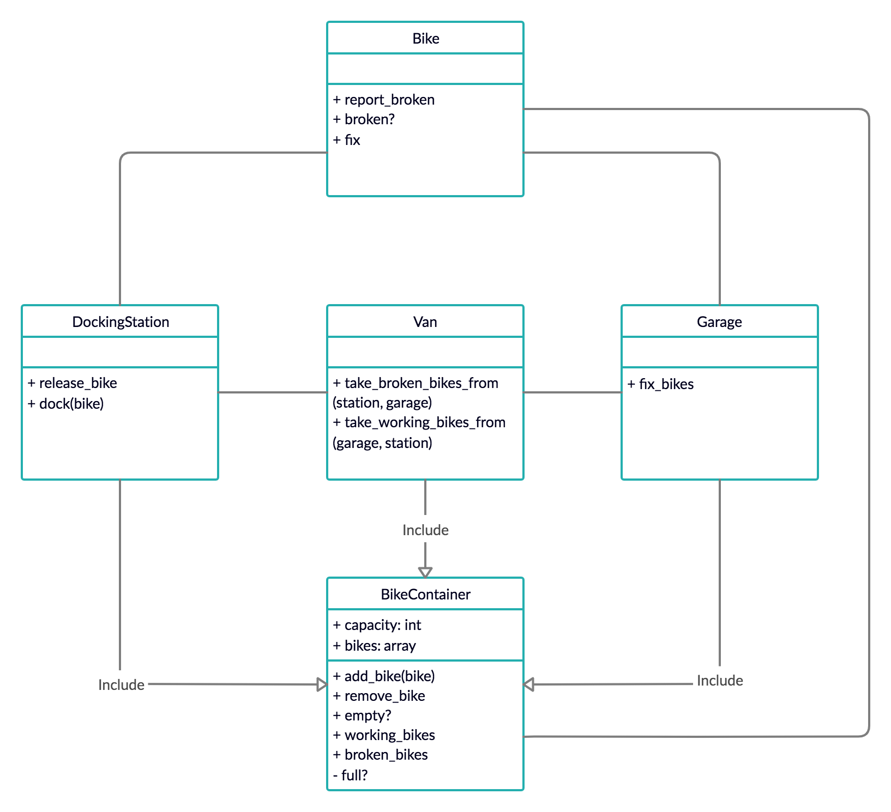

# City Bikes

Object based system to optimize a digital network for a city-bike service. A network of docking stations and bikes that anyone can use.

## Table of Contents
* [Code Quality](#code-quality)
* [Technologies](#technologies)
* [Getting Started](#getting-started)
* [Testing](#testing)
* [Domain Model](#domain-model)
* [Principles and takeaways](#principles-and-takeaways)
* [Analysis](#analysis)
* [Author](#author)

## Code Quality
[](https://codeclimate.com/github/xelAhcratiPsavilO/city_bikes/maintainability)

## Technologies
- Main technology
  - [Ruby](https://www.ruby-lang.org/en/) - High-level, general-purpose language utilized as main technology.
- Unit Test
  - [RSpec](https://rspec.info/) - Domain specific language utilized as testing tool.
- Feature Test
  - [IRB](https://en.wikipedia.org/wiki/Interactive_Ruby_Shell) - Interactive ruby shell utilized as a REPL.
- Documentation
  - [MD](https://www.markdownguide.org/) - Lightweight markup language utilized for documentation.

## Getting Started

Follow the instructions below to clone the repository and run it locally for testing and development demonstrations.

### Prerequisites
- Verify that a current version of Ruby is installed:
```bash
ruby -v
```

### Installing
- Clone the repository:
```bash
git clone git@github.com:xelAhcratiPsavilO/city_bikes.git
```
- Launch irb, pry or other ruby REPL:
```bash
irb
```
### Running
- Load the Bike class (similarly for any other class):
```bash
> require './lib/bike'
=> true
```
- Create a new DockingStation instance (similarly for any other class):
```bash
> station = DockingStation.new
=> #<DockingStation:0x00007f8aee176d50>
```

### Testing
- Launch RSpec to verify that all tests are passing:
```bash
rspec
```
- Expected output:
```bash
.............................
Finished in 0.08404 seconds (files took 0.57766 seconds to load)
38 examples, 0 failures
```

## Domain Model

High-level overview of the entities that make up this functional system.



Based on [client's requirements](USER_STORIES.md).

Objects-Messages [diagram](DIAGRAM.md).

## Principles and takeaways
Letting the stack trace guide a BDD approach contributes to the familiarization with the logs interpretation.
Using guard conditions to raise exceptions is a pattern that catches errors preventing the program from going any further.
Wrapping a collection is a common pattern to define state in a class.
Applying the Single Responsibility Principle is a good practice to increase readability when refactoring.
Removing magical numbers makes an implementation more descriptive.
Doubling objects and stubbing behaviors allows to test units in isolation.
Mixing a Module into several Classes keeps the code dry.

## Analysis
It would have been worth investigating and applying immutability to optimize the algorithms.
It would have been interesting researching the possibility (or not) of making some methods protected, instead of public or private, to allow some Classes to use them but prevent the user access to them.
Researching the possibility of a different syntax for methods that receive two arguments would have increase the readability of such methods.

## Author

Alejandro Pitarch Olivas
